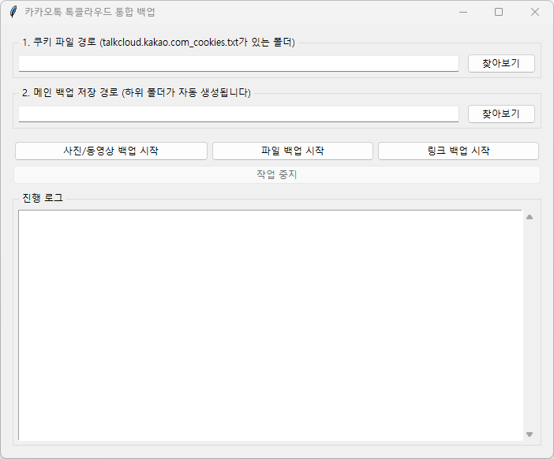
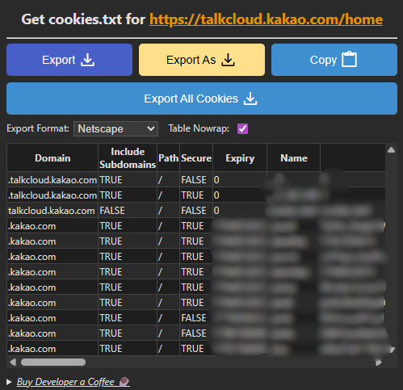

# 카카오톡 톡클라우드 통합 백업 (GUI 버전)

가이드포인트: [Front-line-dev/talkdrive-backup](https://github.com/Front-line-dev/talkdrive-backup)

이 프로그램은 원본 코드를 기반으로 **대대적으로 수정 및 개선**한 버전입니다.

원본 프로그램의 핵심 아이디어(**쿠키를 이용한 API 접근**) 에 감사드립니다.

---

## 🚀 원본과의 주요 차이점 (개선 사항)

1. **[제거]** 원본 삭제 기능 제거 → 백업전용 프로그램입니다. (원본 데이터는 절대 삭제되지 않습니다.)
2. **[추가]** 통합 GUI 제공 → 하나의 프로그램에서 모든 백업을 그래픽 인터페이스로 관리 가능.
3. **[추가]** 3-in-1 통합 백업:
   - 📷 사진 / 동영상 (ZIP 압축)
   - 📁 파일 (HWP, PPTX, DOCX 등) (ZIP 압축)
   - 🔗 링크 (CSV 파일)
4. **[추가]** 메타데이터 보존 → `[날짜]_[채팅방이름]_[원본파일이름]` 형식으로 파일명 저장.
5. **[추가]** 이어받기 기능 → 중단 시 마지막 성공 지점부터 재시작.
6. **[추가]** 폴더 자동 분류 → Photo\_Backup, File\_Backup, Link\_Backup 폴더 자동 생성.
7. **[추가]** `.exe` 실행 파일 제공 → Python 미설치 사용자도 실행 가능.
8. **[추가]** 중지 버튼 → 장시간 작업 중 안전하게 중단 가능.

---

## 🖼 프로그램 스크린샷





---

## 💻 사용 방법 (초보자용: `.exe` 파일)

Python 설치 없이 **실행 파일(.exe)** 로 사용하는 것을 권장합니다.

1. **릴리즈 페이지 이동:** 저장소의 [Releases](https://github.com/YOUR_USERNAME/YOUR_REPO/releases) 탭으로 이동합니다.
2. **파일 다운로드:** 최신 버전의 `TalkCloud_Backup.exe` 파일을 다운로드합니다.
3. **쿠키 확장 프로그램 설치:** [Get cookies.txt LOCALLY](https://chrome.google.com/webstore/detail/get-cookiestxt-locally/cclelndahbckbenkjhflpdbgdldlbecc/) 설치.
4. **톡클라우드 접속:** [https://talkcloud.kakao.com/home](https://talkcloud.kakao.com/home) 에 접속하여 로그인합니다.
5. **쿠키 파일 내보내기:**
   - 톡클라우드 사이트가 열린 상태에서 확장 프로그램 아이콘 클릭 → `Export` 버튼 클릭.
   - 
   - `talkcloud.kakao.com_cookies.txt` 파일이 다운로드됩니다.


6. **파일 배치:**
   - 새 폴더 생성 (예: `D:\카톡백업`)
   - `TalkCloud_Backup.exe` 와 `talkcloud.kakao.com_cookies.txt` 를 함께 넣습니다.
7. **프로그램 실행:** `TalkCloud_Backup.exe` 더블 클릭 →
   - `쿠키 파일 경로`: 자동으로 현재 폴더 지정.
   - `메인 백업 저장 경로`: 백업 저장 폴더 선택.
   - 원하는 백업 버튼(사진/파일/링크) 클릭으로 시작.

---

## 🐍 사용 방법 (개발자용: Python 스크립트)

1. Python 3.x 버전 설치.

2. 터미널에서 다음 명령 실행:

   ```bash
   pip install requests
   ```

3. 위 `.exe` 사용법의 **3\~5단계**에 따라 쿠키 파일 준비.

4. `main.py` 와 `talkcloud.kakao.com_cookies.txt` 를 같은 폴더에 둡니다.

5. 터미널에서 실행:

   ```bash
   python main.py
   ```

6. GUI 창의 안내에 따라 백업 진행.

---

## ⚠️ 중요: 쿠키 파일 이름

- 프로그램은 기본적으로 `talkcloud.kakao.com_cookies.txt` 파일을 찾습니다.
- 없을 경우, 하위 호환용으로 `drive.kakao.com_cookies.txt` 를 확인합니다.
- 가급적 `talkcloud.kakao.com/home`**에서 받은 쿠키** 사용을 권장합니다.

---

##기타: 채팅 파일 백업

-채팅의 백업을 원하신다면 https://github.com/ELJoF7BoG/Kakao-Decrypt-Viewer/tree/master 를 읽어보시길 바랍니다.

## 📝 라이선스

이 프로그램은 원본 저장소의 라이선스를 따릅니다. (원본에 명시된 라이선스가 없으므로 **개인적/비상업적 용도 사용**을 권장합니다.)

---

### 📑 목차

- [카카오톡 톡클라우드 통합 백업 (GUI 버전)](#카카오톡-톡클라우드-통합-백업-gui-버전)
- [🚀 원본과의 주요 차이점](#-원본과의-주요-차이점-개선-사항)
- [🖼 프로그램 스크린샷](#-프로그램-스크린샷)
- [💻 사용 방법 (.exe)](#-사용-방법-초보자용-exe-파일)
- [🐍 사용 방법 (Python)](#-사용-방법-개발자용-python-스크립트)
- [⚠️ 중요: 쿠키 파일 이름](#️-중요-쿠키-파일-이름)
- [📝 라이선스](#-라이선스)
